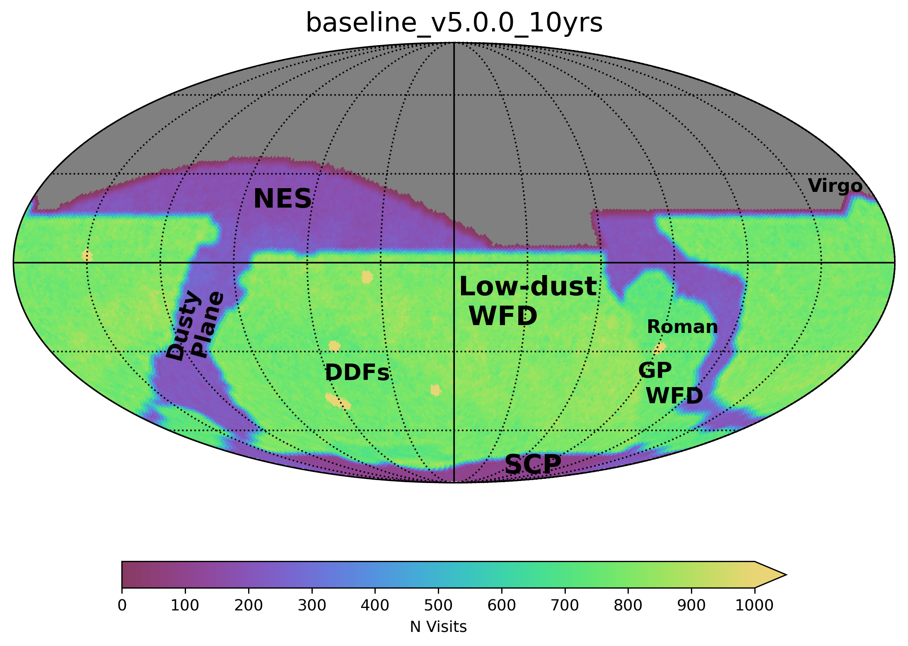

.. Review the README on instructions to contribute.
.. Review the style guide to keep a consistent approach to the documentation.
.. Static objects, such as figures, should be stored in the _static directory. Review the _static/README on instructions to contribute.
.. Do not remove the comments that describe each section. They are included to provide guidance to contributors.
.. Do not remove other content provided in the templates, such as a section. Instead, comment out the content and include comments to explain the situation. For example:
    - If a section within the template is not needed, comment out the section title and label reference. Do not delete the expected section title, reference or related comments provided from the template.
    - If a file cannot include a title (surrounded by ampersands (#)), comment out the title from the template and include a comment explaining why this is implemented (in addition to applying the ``title`` directive).

.. This is the label that can be used for cross referencing this file.
.. Recommended title label format is "Directory Name"-"Title Name" -- Spaces should be replaced by hyphens.
.. _Baseline-Index:
.. Each section should include a label for cross referencing to a given area.
.. Recommended format for all labels is "Title Name"-"Section Name" -- Spaces should be replaced by hyphens.
.. To reference a label that isn't associated with an reST object such as a title or figure, you must include the link and explicit title using the syntax :ref:`link text <label-name>`.
.. A warning will alert you of identical labels during the linkcheck process.

######################
LSST Baseline Strategy
######################

.. This section should provide a brief, top-level description of the page.

|

The Rubin Observatory's current baseline survey (v5.0.0) for LSST consists of :

* :doc:`The "Wide Fast Deep" (WFD) <wfd>`. This is the bulk of the survey, and is designed to achieve the core science goals of the Legacy Survey of Space and Time (LSST). The WFD uses slightly more than 80% of the total survey time.

* :doc:`"Mini" <minis>` and :doc:`"Micro" <micros>` Surveys. These are small sub-surveys that cover a different area on the sky (such as the North Ecliptic Spur, Dusty Plane, or South Celestial Pole) or operate in a different observing 'mode' (such as the near-sun twilight survey). Minisurveys could use between 3-10% of the total survey time, while microsurveys might require 1-3% of the total survey time.

* :doc:`"Deep Drilling Fields" (DDFs) <ddf>`. These are single pointings (about 10 square degrees each), which receive intensive observations on a regular basis. Each DDF will reach at least 1 magnitude deeper than the WFD coadded depths. The DDFs use around 7% of the total survey time.

* :doc:`"Target of Opportunity" (ToOs) <too>` observations. These are simulated ToOs, modeled after the expectations of the `Rubin 2024 ToO workshop <https://lssttooworkshop.github.io/>`_ and consist of around 3% of total survey time.

The current baseline survey strategy is illustrated in the
`baseline_v5.0.0_10yrs <https://s3df.slac.stanford.edu/data/rubin/sim-data/sims_featureScheduler_runs5.0/baseline/baseline_v5.0.0_10yrs.db>`_
simulation, although this (and any) simulation is limited in its representative
status due to the fact that is a specific implementation under specific weather
and observatory conditions. Changes to the survey simulation over time can be found
in the :doc:`Changes <changes>` section.

.. toctree::
    :maxdepth: 1
    :glob:
    :hidden:

    wfd

    minis

    ddf

    micros

    too

    changes

.. admonition:: Last Updated

   Last Updated 2025/07/28

..   *
