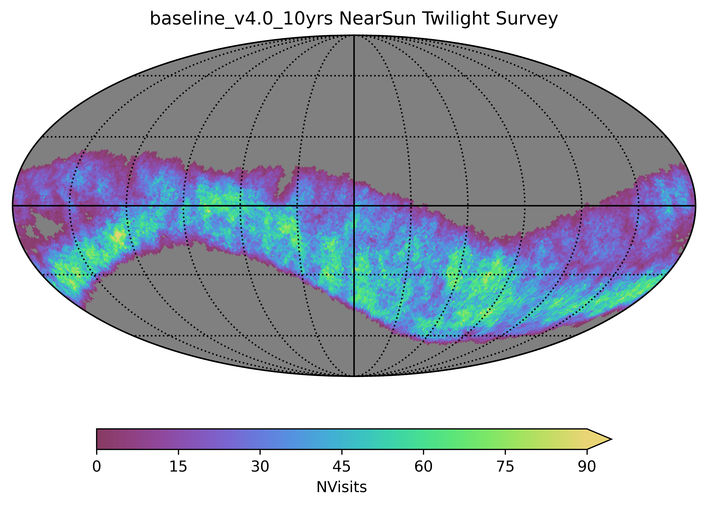
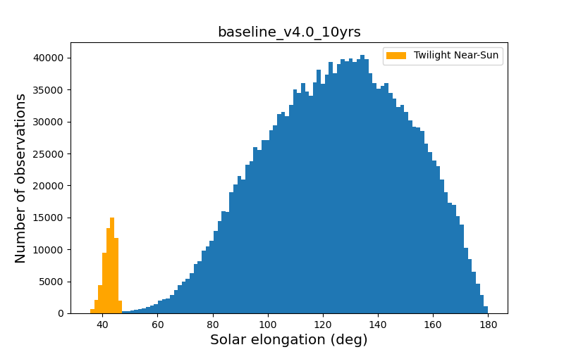

.. Review the README on instructions to contribute.
.. Review the style guide to keep a consistent approach to the documentation.
.. Static objects, such as figures, should be stored in the _static directory. Review the _static/README on instructions to contribute.
.. Do not remove the comments that describe each section. They are included to provide guidance to contributors.
.. Do not remove other content provided in the templates, such as a section. Instead, comment out the content and include comments to explain the situation. For example:
    - If a section within the template is not needed, comment out the section title and label reference. Do not delete the expected section title, reference or related comments provided from the template.
    - If a file cannot include a title (surrounded by ampersands (#)), comment out the title from the template and include a comment explaining why this is implemented (in addition to applying the ``title`` directive).

.. This is the label that can be used for cross referencing this file.
.. Recommended title label format is "Directory Name"-"Title Name" -- Spaces should be replaced by hyphens.
.. _Baseline-Micros:
.. Each section should include a label for cross referencing to a given area.
.. Recommended format for all labels is "Title Name"-"Section Name" -- Spaces should be replaced by hyphens.
.. To reference a label that isn't associated with an reST object such as a title or figure, you must include the link and explicit title using the syntax :ref:`link text <label-name>`.
.. A warning will alert you of identical labels during the linkcheck process.

#####################
Micro Surveys
#####################

.. This section should provide a brief, top-level description of the page.

At this time, the SCOC has only endorsed one microsurvey, the near-sun twilight
microsurvey. If commissioning or early operations shows sufficient survey efficiency,
an additional microsurvey covering a small area of sky northward of the WFD may be added.
The addition of further microsurveys will be considered after the start of Operations.

The Near-Sun Twilight Microsurvey
=================================

This microsurvey extends the discovery space for Solar System Objects to the region
interior to the Earth, with the addition of observations at very low solar elongation.

The number of visits per pointing acquired for the near-sun twilight microsurvey, over ten years.

The near-sun twilight microsurvey operates during twilight, from -12 degree twilight
up to approximately -18 degree twilight (but usually only up until about -15 degree twilight).
Observations are taken in 15-second visits in riz filters. The visits are obtained
in sets of four -- quads -- in order to be able to identify moving objects within
each twilight before the objects become inaccessible due to their location on the sky.

Visits are focused on an area within 20 degrees of the ecliptic plane, and at solar
elongations between 35 and 47 degrees. Less than 1% of the standard survey visits occur
at solar elongations less than 68 degrees. The near-sun twilight observations occur at
airmasses of 1.8 and greater.

.. toctree::
    :maxdepth: 2
    :titlesonly:
    :glob:

..   *
