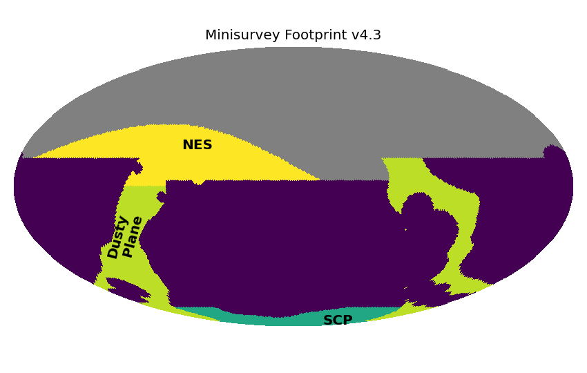

.. Review the README on instructions to contribute.
.. Review the style guide to keep a consistent approach to the documentation.
.. Static objects, such as figures, should be stored in the _static directory. Review the _static/README on instructions to contribute.
.. Do not remove the comments that describe each section. They are included to provide guidance to contributors.
.. Do not remove other content provided in the templates, such as a section. Instead, comment out the content and include comments to explain the situation. For example:
    - If a section within the template is not needed, comment out the section title and label reference. Do not delete the expected section title, reference or related comments provided from the template.
    - If a file cannot include a title (surrounded by ampersands (#)), comment out the title from the template and include a comment explaining why this is implemented (in addition to applying the ``title`` directive).

.. This is the label that can be used for cross referencing this file.
.. Recommended title label format is "Directory Name"-"Title Name" -- Spaces should be replaced by hyphens.
.. _Baseline-Minis:
.. Each section should include a label for cross referencing to a given area.
.. Recommended format for all labels is "Title Name"-"Section Name" -- Spaces should be replaced by hyphens.
.. To reference a label that isn't associated with an reST object such as a title or figure, you must include the link and explicit title using the syntax :ref:`link text <label-name>`.
.. A warning will alert you of identical labels during the linkcheck process.

#####################
Mini-Surveys
#####################

.. This section should provide a brief, top-level description of the page.

The LSST mini-surveys extend the survey footprint to additional areas of sky which
are important for the core science goals, but do not require coverage at standard WFD
levels.

The total sky area in minisurveys is 7.5k square degrees.

North Ecliptic Spur (NES)
=========================

The North Ecliptic Spur (NES) includes the region north of the WFD footprint,
up to ecliptic latitude of +10 degrees. This enables discovery and monitoring
of Solar System Objects throughout the ecliptic plane.

The NES is only observed in g, r, i and z filters, dropping u and y, with
a median of 180 visits per pointing.

Dusty (Galactic) Plane
======================

Portions of the Galactic Plane are covered at WFD levels, however this is not
possible for the entire plane. The remainder of the galactic plane
is included in the Dusty Plane minisurvey, which receives approximately 220
visits per pointing.

South Celestial Pole
====================

The South Celestial Pole (SCP) covers the remainder of the visible southern sky beyond
the WFD (and Magellanic Cloud extension in the LMC + SMC) and dusty plane.
This completes the survey footprint. The SCP receives approximately 115 visits
per pointing.

.. toctree::
    :maxdepth: 2
    :titlesonly:
    :glob:

..   *
