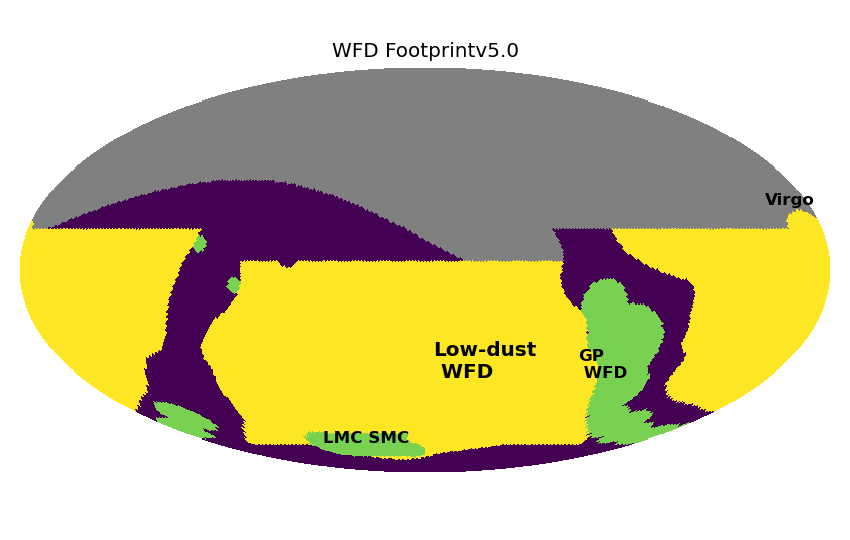
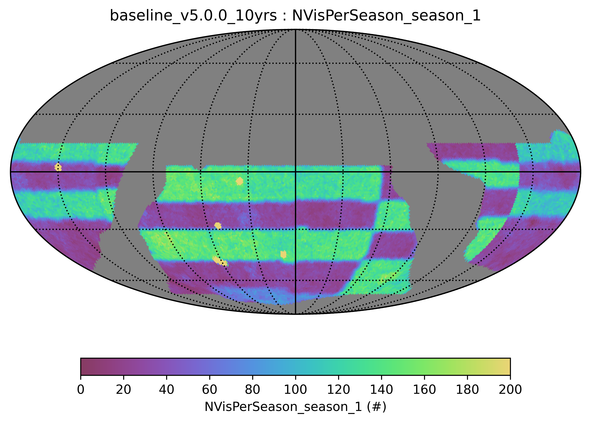
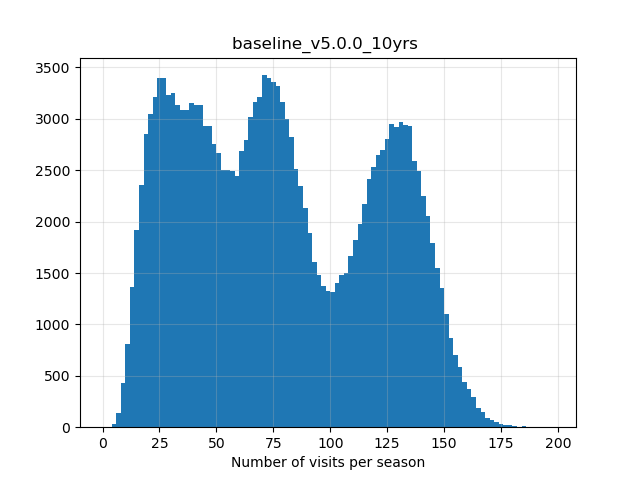
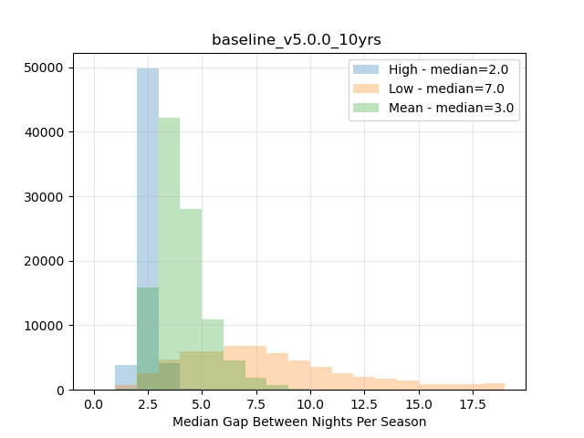

.. Review the README on instructions to contribute.
.. Review the style guide to keep a consistent approach to the documentation.
.. Static objects, such as figures, should be stored in the _static directory. Review the _static/README on instructions to contribute.
.. Do not remove the comments that describe each section. They are included to provide guidance to contributors.
.. Do not remove other content provided in the templates, such as a section. Instead, comment out the content and include comments to explain the situation. For example:
    - If a section within the template is not needed, comment out the section title and label reference. Do not delete the expected section title, reference or related comments provided from the template.
    - If a file cannot include a title (surrounded by ampersands (#)), comment out the title from the template and include a comment explaining why this is implemented (in addition to applying the ``title`` directive).

.. This is the label that can be used for cross referencing this file.
.. Recommended title label format is "Directory Name"-"Title Name" -- Spaces should be replaced by hyphens.
.. _Baseline-WFD:
.. Each section should include a label for cross referencing to a given area.
.. Recommended format for all labels is "Title Name"-"Section Name" -- Spaces should be replaced by hyphens.
.. To reference a label that isn't associated with an reST object such as a title or figure, you must include the link and explicit title using the syntax :ref:`link text <label-name>`.
.. A warning will alert you of identical labels during the linkcheck process.

#########################
Wide Fast Deep (WFD)
#########################

.. This section should provide a brief, top-level description of the page.

Rubin Observatory's LSST Wide Fast Deep (WFD) composes the bulk of the survey's visits,
using about 80% of the total survey time. The WFD is designed to achieve much of the core
science goals of the LSST.

The WFD sky includes low-dust extinction area, useful for extragalactic science, as well
as higher stellar density areas (with higher dust extinction), useful for
galactic science. The total area in the WFD is approximately 19.6k square degrees.

The Wide Fast Deep regions in the survey footprint.

WFD Visit Cadence
=================

All of the WFD area receives approximately the same number of visits per pointing
(around 800), although the balance of visits between different filters varies
between the low-dust and other areas.

The low-dust WFD uses a *rolling cadence*, alternating high and low activity
areas on the sky each year.  There is no rolling in year one, to provide uniform
all-sky coverage at the first full data release for better calibration and catalog creation.

Visits in the WFD are typically obtained in pairs - the first and second
visit to a pointing are separated by about 33 minutes. These pairs are obtained
in different filters except for y band: u+g, u+r, g+r, r+i, i+z, z+y, y+y.
Using different filters for pairs allows determination of colors for variables
and transients.
About 3% of all pairs (4% of all visits) receive a later (3-7 hours later) third visit in the
same filter as one of the earlier pair. While these triplets are a small fraction
of the overall visits, they provide valuable opportunities for fast transient
identification.

In general, each pointing receives a return visit between 2 to 4 days later,
when the pointing is in an active rolling season. Inactive seasons have a lower
cadence. These return visits will often be in a different set of filters, but
this depends on the lunar phase.

The filters in use depend on the lunar phase, with u and y band being loaded
into and out of the camera every two weeks. Approximately 7 days after new moon,
the u band filter comes out of the camera and the y band filter is put in; this
process reverses 7 days before new moon.

WFD Rolling Cadence
===================

As part of the *rolling cadence*, regions of the low-dust WFD go through cycles of
high and low cadence activity in alternating seasons. There is no rolling within
year one, in order to provide more uniform all-sky coverage at the first full data
release containing the whole survey footprint. When rolling commences, the low-dust
WFD footprint is split into two sets of declination-bounded regions; these
"declination stripes" then are set into cycles of higher/lower cadence in
alternating seasons. After a complete high/low (or low/high) cycle, the same number of
visits has been acquired in each region as would have been acquired if the typical
average cadence had been followed over the same period.

        
Splitting the sky with declination-bounded regions for rolling cadence.

In a ten year LSST, with no rolling in year one and using two sets of declination
bounded regions, there is potentially time for four complete cycles (high/low or
low/high) before the end of the survey. Alternately, more seasons with the average
cadence can be inserted into the middle years of the survey, providing more
uniform sky coverage at intermediate data releases at year 4 and year 7, with a total
of three cycles of rolling throughout the low-dust WFD during the survey. This
second option has been coined "uniform rolling" and is implemented in the current
baseline. The four-cycle rolling cadence is still under discussion; the SCOC decision
on three versus four cycles of rolling will likely come after the start of Operations
once the recovery of faster timescale transient discovery is better understood.

During an average-cadence season, a low-dust WFD pointing would typically receive on the
order of 80 visits (800 visits total / 10 seasons). In a low-cadence season, the
number of visits drops to on the order of 25 visits; in a high-cadence season the number
of visits is closer to 125. In all cases, the average season length remains on the order of 180 days.

        high, low and medium activity groups.

In low-activity seasons, the total number of visits drops and the inter-night gap increases.
In high-actvity seasons, the total number of visits increases above the median, and the inter-night gap decreases.
        
.. toctree::
    :maxdepth: 2
    :titlesonly:
    :glob:

.. admonition:: Last Updated

   Last Updated 2025/07/28

..   *
