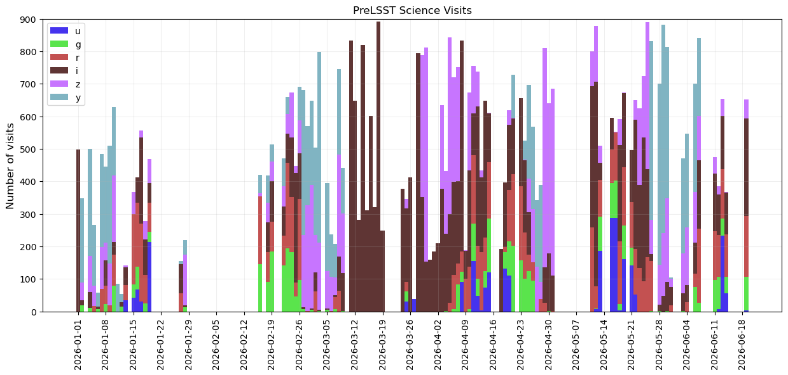
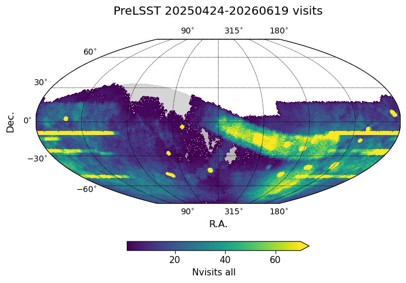
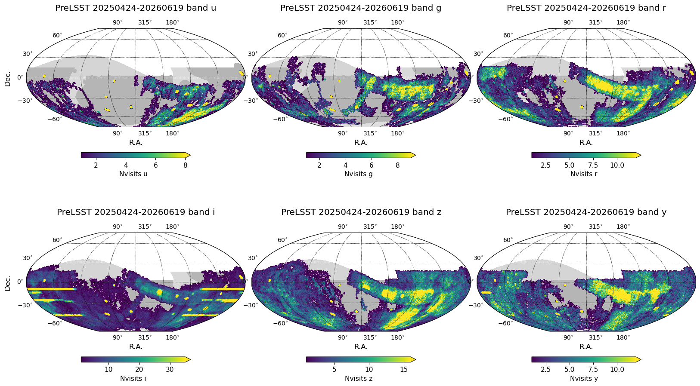
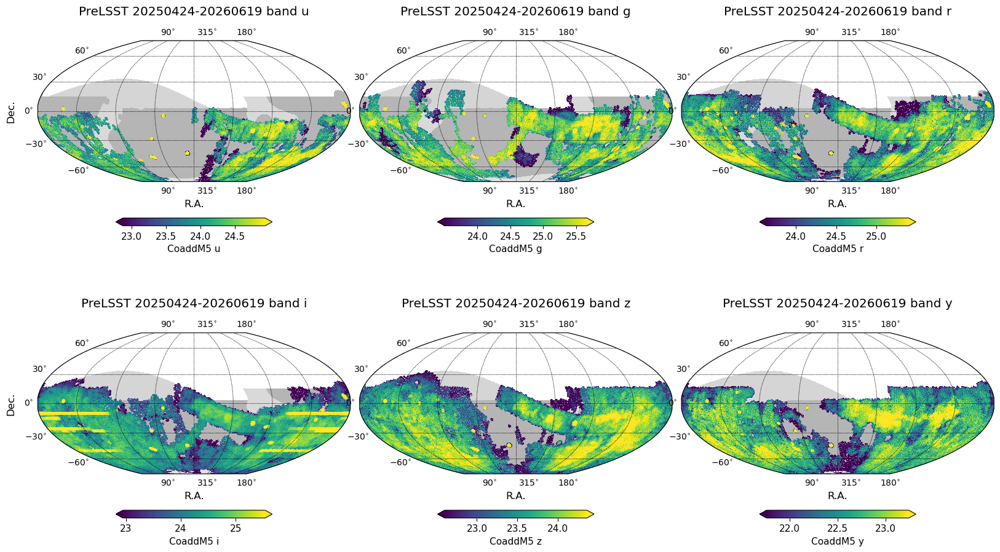
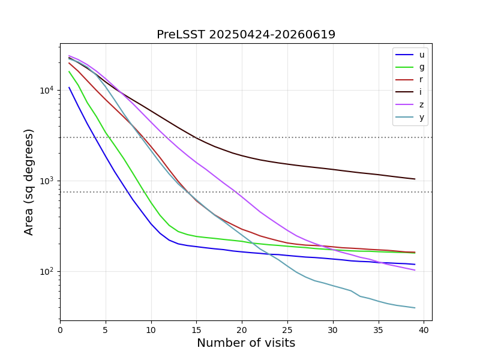
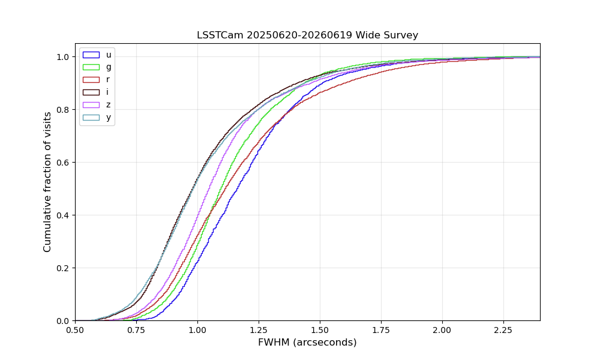
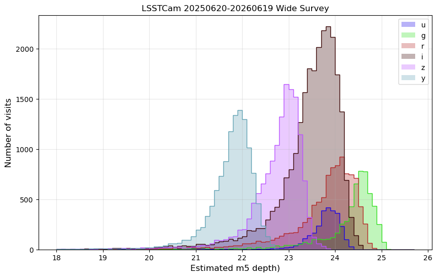

.. Review the README on instructions to contribute.
.. Review the style guide to keep a consistent approach to the documentation.
.. Static objects, such as figures, should be stored in the _static directory. Review the _static/README on instructions to contribute.
.. Do not remove the comments that describe each section. They are included to provide guidance to contributors.
.. Do not remove other content provided in the templates, such as a section. Instead, comment out the content and include comments to explain the situation. For example:
    - If a section within the template is not needed, comment out the section title and label reference. Do not delete the expected section title, reference or related comments provided from the template.
    - If a file cannot include a title (surrounded by ampersands (#)), comment out the title from the template and include a comment explaining why this is implemented (in addition to applying the ``title`` directive).

.. This is the label that can be used for cross referencing this file.
.. Recommended title label format is "Directory Name"-"Title Name" -- Spaces should be replaced by hyphens.
.. _pre-lsst-20260610:
.. Each section should include a label for cross referencing to a given area.
.. Recommended format for all labels is "Title Name"-"Section Name" -- Spaces should be replaced by hyphens.
.. To reference a label that isn't associated with an reST object such as a title or figure, you must include the link and explicit title using the syntax :ref:`link text <label-name>`.
.. A warning will alert you of identical labels during the linkcheck process.

#############################
Pre-LSST 20260619
#############################

The Pre-LSST survey continues after the
`Data Preview 2 (DP2) <https://rtn-111.lsst.io>`_ cutoff.
Image quality continues to improve, as well as survey speed.
Periodic faults within a night are being beaten down and there are significantly
fewer interruptions than during the SV commissioning period, although the observatory continues
to have occasional periods of downtime due to larger system problems.

Visits prior to January 6, 2026, are based on the DP2 visit list and include 28698 visits in total.
Pre-LSST visits post January 6, 2026 include all on-sky science images.
These science images are primarily from the FBS operating in LSST-like mode (44928 visits)
however there are also 10360 images coming from AOS stability tests,
where the Simonyi Survey Telescope
acquires images at a fixed altitude/azimuth position in a single filter
for a set period of time. These AOS stability images are primarily acquired in *i* band.
The total number of science visits from DP2 plus Pre-LSST up to June 19, 2026, is 83986.

  Timeline of science visit acquisition after January 6, 2026.

The period of extensive *i* band visits in the middle of March is due
to AOS stability test images. During this time period, the FBS continued
to operate with a single-visit template tier.

Visit Database
==============

A pointing database similar to the one released at the end of the SV survey
is available for download from
`prelsst_20260619_visits.db <https://s3df.slac.stanford.edu/data/rubin/sim-data/prelsst/prelsst_20260619_visits.db>`_

This database follows the DP2 visit list up to January 6, 2026.
After January 6, 2026, all on-sky science visits have been included.
Especially for visits not vetted as part of DP2, this database likely includes
visits which may may be found not suitable for science.

Coverage
========

  Number of Pre-LSST visits, all bands. The AOS stability tests clearly stand out as stripes at constant declination.

  Number of Pre-LSST visits, per band.

  Rough estimate of potential coadded 5-sigma point source limiting magnitude. Not all visits would be included in coadds.

The median number of visits per point on the sky,
for the entire LSST footprint (27188 sq degrees in area)
the entire SV original footprint (3k sq degrees),
the reduced SV footprint (750 sq degrees) and
the central 300 sq degrees of the SV footprint.

===================  ====  ====  ====  ====  ====  ====  =====
Nvisits               u     g     r     i     z     y    all
===================  ====  ====  ====  ====  ====  ====  =====
LSST                  0     1     2     4     4     4     18
3k                    2     5     8    10     9     8     47
750                   2     6    13    16    12    12     63
300                   2     6    11    18    19    14     72
===================  ====  ====  ====  ====  ====  ====  =====

    Area covered with at least X visits per band to date.

Estimated image quality
=======================

  The distribution of estimated FWHM for Pre-LSST wide (SV and Pre-LSST) area.

  The distribution of estimated 5-sigma PSF magnitude limit for Pre-LSST wide (SV and Pre-LSST) area visits.

The table below compares the delivered image quality over the period April 19, 2026 -- June 19, 2026,
to the predicted image quality over the same months of the year in our current baseline simulation, `baseline_v5.3.0_10yrs.db <https://s3df.slac.stanford.edu/data/rubin/sim-data/sims_featureScheduler_runs5.3/baseline/baseline_v5.3.0_10yrs.db>`_.
Note that these are the median values of all visit, and median value across the field of view
and thus will not capture outliers.

==========  ================  ======================  ==================  ===========
band          median airmass    median fwhm (arcsec)    mean cloud (mag)    median m5
==========  ================  ======================  ==================  ===========
baseline u              1.16                    1.1                 0           23.35
PreLSST u               1.13                    1.14                0.69        23.79
baseline g              1.17                    1.04                0           24.52
PreLSST g               1.11                    1                   0.49        24.54
baseline r              1.18                    0.98                0           23.98
PreLSST r               1.14                    1.02                0.46        24
baseline i              1.2                     0.92                0           23.51
PreLSST i               1.11                    0.96                0.38        23.52
baseline z              1.21                    0.9                 0           22.96
PreLSST z               1.15                    0.99                0.39        22.84
baseline y              1.25                    0.91                0           21.98
PreLSST y               1.13                    0.92                0.24        21.83
==========  ================  ======================  ==================  ===========

The FWHM and point-source 5-sigma limiting magnitude values above come from the
real-time ``Rapid Analysis QuickLook`` processing that occurs on the summit.
This processing provides real-time feedback for the AOS pipelines and other uses.
Different data management processing pipelines use different configurations and can
result in different values for FWHM or m5, due to many factors, including the selection
of input stars for calibration. The values coming from other pipelines, such as
Data Release Pipelines, will likely be similar, but should
be expected to show some differences,
particularly when evaluating a particular visit or detector.

.. admonition:: Last Updated

   Last Updated 2026/06/28

..   *
