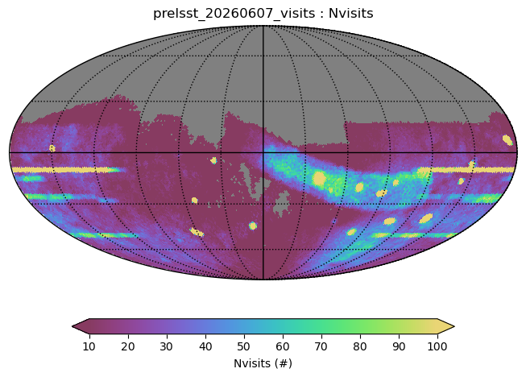
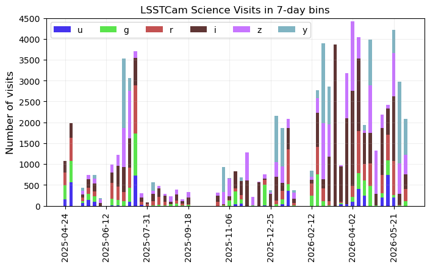
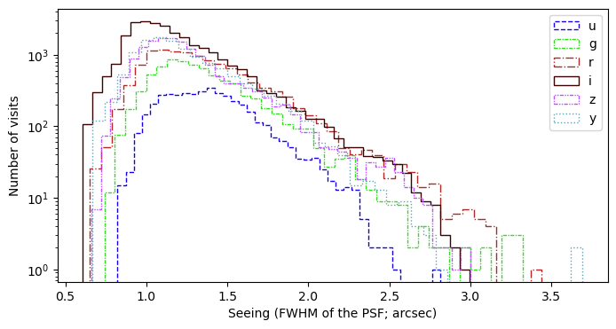
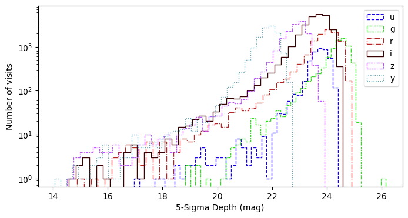

.. Review the README on instructions to contribute.
.. Review the style guide to keep a consistent approach to the documentation.
.. Static objects, such as figures, should be stored in the _static directory. Review the _static/README on instructions to contribute.
.. Do not remove the comments that describe each section. They are included to provide guidance to contributors.
.. Do not remove other content provided in the templates, such as a section. Instead, comment out the content and include comments to explain the situation. For example:
    - If a section within the template is not needed, comment out the section title and label reference. Do not delete the expected section title, reference or related comments provided from the template.
    - If a file cannot include a title (surrounded by ampersands (#)), comment out the title from the template and include a comment explaining why this is implemented (in addition to applying the ``title`` directive).

.. This is the label that can be used for cross referencing this file.
.. Recommended title label format is "Directory Name"-"Title Name" -- Spaces should be replaced by hyphens.
.. _pre-lsst-2026:
.. Each section should include a label for cross referencing to a given area.
.. Recommended format for all labels is "Title Name"-"Section Name" -- Spaces should be replaced by hyphens.
.. To reference a label that isn't associated with an reST object such as a title or figure, you must include the link and explicit title using the syntax :ref:`link text <label-name>`.
.. A warning will alert you of identical labels during the linkcheck process.

####################
Summary, June 7 2026
####################

A database file of observational metadata is available in the Rubin Science Platform, along with a tutorial notebook that demonstrates how to query, load, and visualize the metadata (``Commissioning/101_LSSTCam_visits_metadata``).
An executed version is available in the `Prompt Products tutorials <https://prompt-products.lsst.io/tutorials/index.html>`_, and some of the plots created in that tutorial are shown below.
The file and tutorial are made available on a temporary basis, until they're superseded by a data release.

Overview
========

Science images with LSSTCam began on 04 April 2025, at first targeting the small field survey regions which contributed toward `Rubin First Look <https://rubinobservatory.org/news/rubin-first-look>`_.
The Science Validation (SV) survey began on 20 June 2025, acquiring visits in a manner consistent with the planned operations survey for the LSST.
Sky coverage included the small field survey regions, a contiguous region of the ecliptic plane within the planned LSST Wide Fast Deep (WFD) region, and the Deep Drilling Fields (DDFs).
The scientifically validated subset of these images obtained prior to Jan 7 2026 will be released as Data Preview 2 (DP2).
See the :doc:`/progress/sv_status/sv_20250930` for a review of observations up to 30 September 2025.

Throughout the first half of 2026, pre-LSST visits were obtained in the DDFs where templates exist, for the purpose of alert production.
Visits were also obtained for engineering and Active Optics System (AOS) commissioning, with the goal of reaching stable image quality metrics which meet the conditions for starting the LSST.
Many of the latter visits have been tagged as suitable for science (pending processing and science validation), and are included in this summary.

Caveats
=======

**Not all of these visits lead to scientifically validated data products.**
Some will end up excluded from the DP2 and the Prompt Products datasets.
Although an initial cut of bad visits have been made on the inputs to the database, users should expect that additional cuts post-processing.

**Image quality (IQ) is variable.**
The database file excludes bad visits, but includes visits with a wide range of data quality due to both cloud extinction and/or delivered IQ or engineering issues.
Keep in mind that while these visits were obtained, the AOS was being commissioned.

**Measured IQ values may change.**
The seeing and depth values plotted below are *initial* estimates.
Some columns contain NaNs, where the summit quicklook processing did not provide a useful value.
Many of these problems will be resolved with later processing.
Users should anticipate that some measured IQ values will change.

Coverage
========

  Sky coverage density of LSSTCam visits as of June 7 2026.

  The number of LSSTCam visits over time, stacked by filter, in 7-day bins.

Estimated image quality
=======================

  The distribution of estimated seeing for all LSSTCam visits, as of June 7 2026.

  The distribution of estimated 5-sigma PSF magnitude limit for all LSSTCam visits, as of June 7 2026.

.. admonition:: Last Updated

   Last Updated 2026/06/13

..   *
