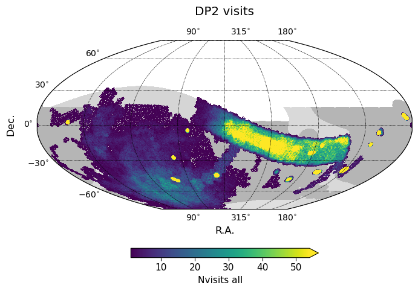
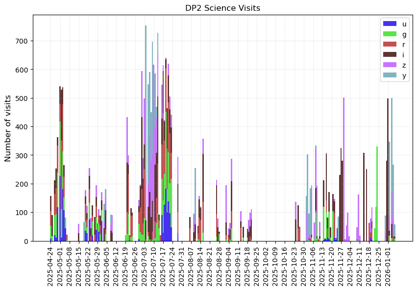
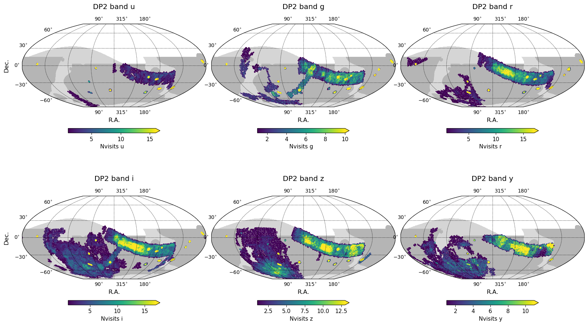
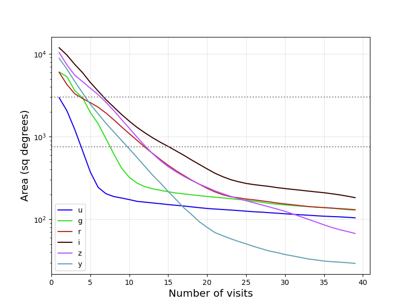
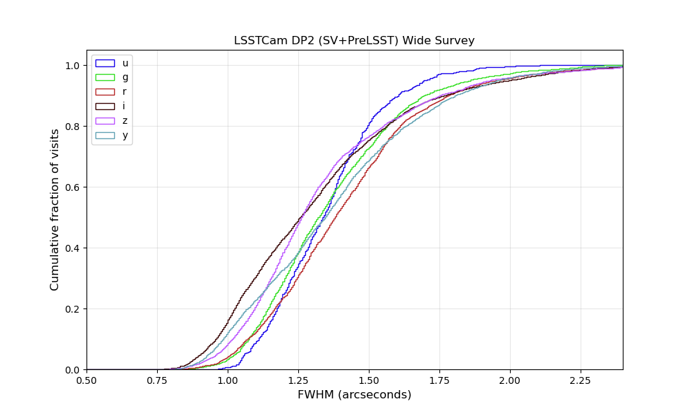
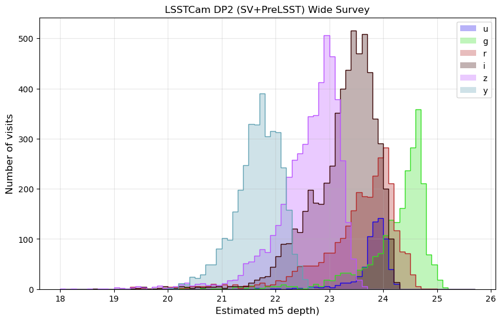

.. _PreLSST-DP2:

#############################
Data Preview 2 (DP2)
#############################

The official definition of Data Preview 2 (DP2) is provided in
`RTN-111 <https://rtn-111.lsst.io>`_.
In addition, the Community Science Team have produced a database file
of observational metadata,
available in the `Rubin Science Platform <https://data.lsst.cloud/>`_,
along with a tutorial notebook that demonstrates how to query,
load, and visualize the metadata (``Commissioning/101_LSSTCam_visits_metadata``).
An executed version of the tutorial is available in the `Prompt Products documentation <https://prompt-products.lsst.io/tutorials/index.html>`_.

Survey Configuration
====================

DP2 primarily contains observations coming from early commissioning and SV survey data,
thus has considerable overlap with the summary posted in
:doc:`Summary 20250930 <../sv_status/sv_20250930>`.
It also contains observations obtained during the Pre-LSST period from
October 24, 2025 to January 6, 2026, although unless these overlapped existing
commissioning and SV areas, they were not combined into coadds.

While the SV data was intended to mimic standard LSST observations, it was
necessarily compressed in cadence in order to reach depths suitable for testing
coadds within the short period of the SV survey timeline. The Pre-LSST data
is primarily aimed at providing a testing ground for additional image quality
and survey speed, and as such has been released to cover the full LSST
footprint. However, to support image quality testing, at times the survey
configuration may also have additional constraints, either in altitude limits,
in the bandpasses available, or in terms of additional observations inserted
after filter changes. As the Pre-LSST observations also share time
with other engineering activities, the overall cadence is also significantly lower
than would be expected in full LSST surveying mode.

Visit Database
==============

A pointing database similar to the one released at the end of the SV survey
is available for download from
`dp2_visits.db <https://s3df.slac.stanford.edu/data/rubin/sim-data/prelsst/dp2_visits.db>`_

Note that not all detectors or visits may end up processed successfully
through all DP2 pipelines. The visit database represents the set of visits
that were included in the DP2 inputs and successfully made it to some early pipeline stage.
Compared to the `lsstcam_20250930 <https://s3df.slac.stanford.edu/data/rubin/sim-data/sv/sv_progress_databases/lsstcam_20250930/lsstcam_20250930.db>`_
linked from
:doc:`Summary 20250930 <../sv_status/sv_20250930>`,
1217 out of the original 21647 are not part of the DP2 visit list,
and have been found to be *bad* for a variety of reasons
(primarily being out of focus or trailed). This leaves 20430 SV survey visits
contributing to DP2.

As described in `RTN-111 <https://rtn-111.lsst.io>`_, not all visits will be
included in the coadds or used to create templates. Visits with FWHM > 1.7 arcseconds
or effTimeZeroPointScale (an estimate of total extinction in the image) > 0.75
may be included in the coadds, although additional detector-level cuts are possible.
Approximately 16317 SV visits meet these constraints.

Including all commissioning, SV and Pre-LSST visits, the DP2 visit list
encompasses 28698 visits in total.

Data Acquisition
================

  Timeline of science visit acquisition for DP2.

The timeline of visit acquisition over the commissioning and SV period
has been covered previously, but the period from October 2025 to January 2026
contains a variety of Pre-LSST observations.

Notably, there were a significant number of *i* band images acquired toward
the end of October. This was a period of AOS testing, exploring the impact
of (not) changing the filter. There were occasional similar tests during
the next few months, although often staying in the same bandpass
was a choice coming from the Feature Based Scheduler itself, as it
attempted to gather coverage in the best bandpass for a single night
in order to attempt building templates.

During much of the Pre-LSST survey, while the FBS activity on-sky
has been quite intermittent (thus making it difficult to expect a regular
cadence of visits), the FBS has been configured with a
single-visit template tier. This template tier became a priority
during commissioning when the SV survey struggled to acquire visits
sufficient to build templates.

This does have implications for the cadence of observations in DP2 however.
The bulk (70%) of DP2 visits come from the SV survey and DDFs, thus have a higher
cadence than LSST; the Pre-LSST visits have a lower cadence than LSST and
may be further perturbed in cadence due to bandpass constraints.

Coverage
========

  Number of DP2 visits, all bands.

  Number of DP2 visits, per band.

    Area covered with at least X visits per band in DP2.

Estimated image quality
=======================

  The distribution of estimated FWHM for DP2 wide (SV and Pre-LSST) area.

  The distribution of estimated 5-sigma PSF magnitude limit for DP2 wide (SV and Pre-LSST) area visits.

The FWHM and point-source 5-sigma limiting magnitude values above come from the
real-time ``Rapid Analysis QuickLook`` processing that occurs on the summit.
This processing provides real-time feedback for the AOS pipelines and other uses.
Different data management processing pipelines use different configurations and can
result in different values for FWHM or m5, due to many factors, including the selection
of input stars for calibration. The actual DP2 values will likely be similar, but should
be expected to show some differences, particularly when evaluating a particular visit or
detector.

.. admonition:: Last Updated

   Last Updated 2026/06/28

..   *
