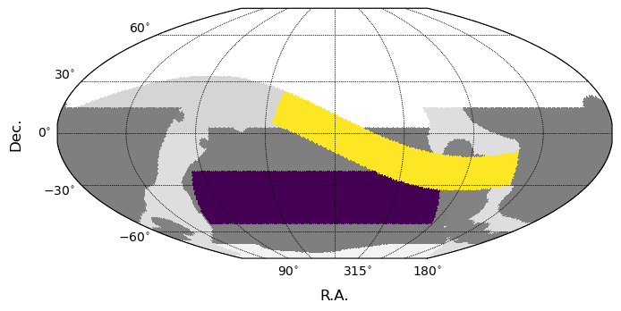
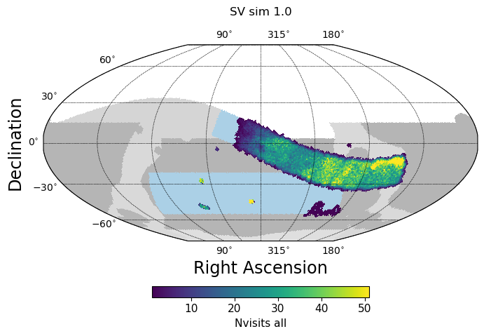

.. Review the README on instructions to contribute.
.. Review the style guide to keep a consistent approach to the documentation.
.. Static objects, such as figures, should be stored in the _static directory. Review the _static/README on instructions to contribute.
.. Do not remove the comments that describe each section. They are included to provide guidance to contributors.
.. Do not remove other content provided in the templates, such as a section. Instead, comment out the content and include comments to explain the situation. For example:
    - If a section within the template is not needed, comment out the section title and label reference. Do not delete the expected section title, reference or related comments provided from the template.
    - If a file cannot include a title (surrounded by ampersands (#)), comment out the title from the template and include a comment explaining why this is implemented (in addition to applying the ``title`` directive).

.. This is the label that can be used for cross referencing this file.
.. Recommended title label format is "Directory Name"-"Title Name" -- Spaces should be replaced by hyphens.
.. _SV_Status-Index:
.. Each section should include a label for cross referencing to a given area.
.. Recommended format for all labels is "Title Name"-"Section Name" -- Spaces should be replaced by hyphens.
.. To reference a label that isn't associated with an reST object such as a title or figure, you must include the link and explicit title using the syntax :ref:`link text <label-name>`.
.. A warning will alert you of identical labels during the linkcheck process.

###################################
Status of Science Validation Survey
###################################

.. This section should provide a brief, top-level description of the page.

The design of the Science Validation (SV) survey is described in
`SITCOMTN-005 <https://sitcomtn-005.lsst.io>`_ section 6.

The SV survey is intended to replicate the operations LSST as closely
as possible, while still allowing significant tests of alert generation,
data release creation, and providing a scientifically significant dataset
to the astronomical community.

The survey strategy is thus generally similar to that of the operations LSST,
however in order to reach depths equivalent to 1-2 years of standard LSST
observing within the timeframe of the 2-3 months available during commissioning,
the footprint is much smaller than the full survey footprint and pointings are
generally repeated at least every night instead of every few nights.
The cadence within a night is roughly similar to the operations survey, with
observations typically obtained in pairs of visits separated by 30 minutes or so,
but the return visits to the field on subsequent nights are more frequent.

The footprint for the SV survey consists primarily of just over 3000 square
degrees focused along the ecliptic, reaching from within the Galactic Plane to
within the North Ecliptic Spur portion of the LSST footprint. Additional area
within the LSST low-dust WFD footprint will be covered on a best-effort basis
in order to obtain images which can be used for template building; this area
primarily serves as backup for when the ecliptic portion of the footprint is
unavailable due to the moon avoidance mask or at times in the morning when the telescope
is limited in azimuth range due to dome closure rules in effect during commissioning.

An initial survey simulation, with an estimate for the performance of the
observatory, indicates that the SV survey should be capable of acquiring on the order
of 125 visits per pointing within the primary SV survey area.

.. toctree::
    :maxdepth: 2
    :titlesonly:
    :glob:

    sv_20250720

.. admonition:: Last Updated

   Last Updated 2025/07/20

..   *
