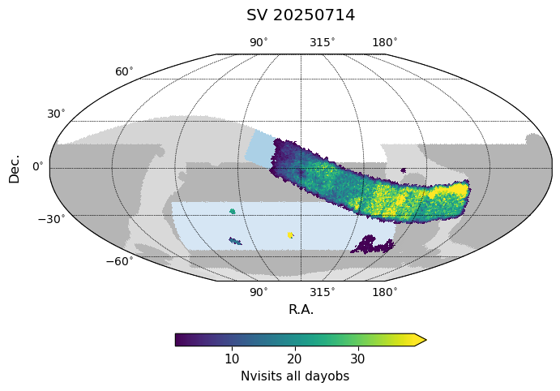
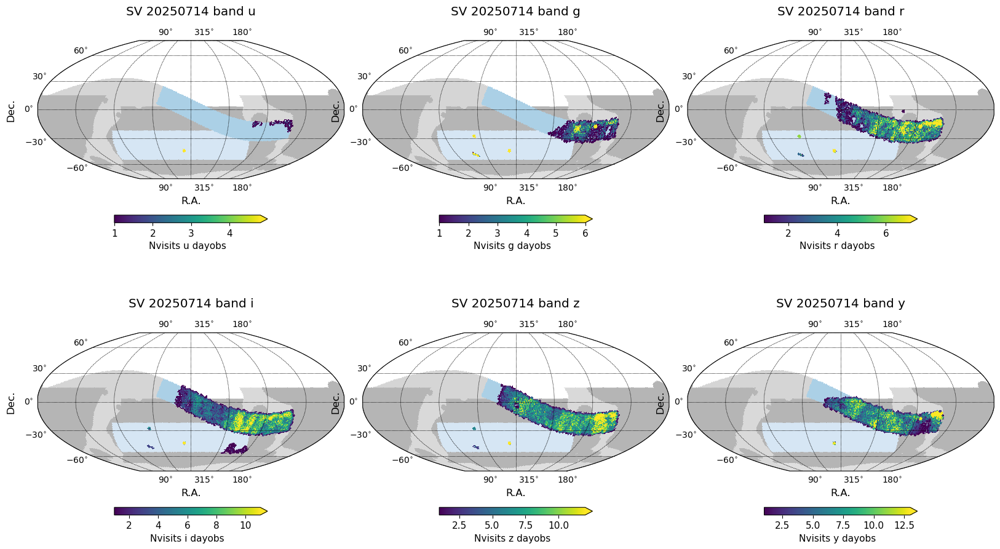
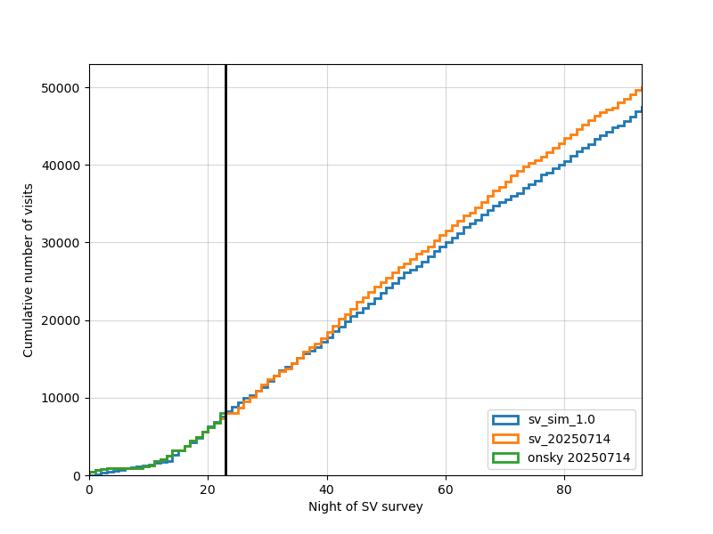

.. _SV_20250714:

 
############
SV 20250714
############

 
As of 20250714, the SV survey has acquired a total of 8065 visits, of variable quality. 
The median numbers of visits per pointing within the primary wide SV survey area are: 

=====================  ===  ===  ===  ===  ===  ===  =====
..                       u    g    r    i    z    y    all
=====================  ===  ===  ===  ===  ===  ===  =====
(20250714, 'Nvisits')    0    0    3    5    6    5     22
=====================  ===  ===  ===  ===  ===  ===  =====

A simulation database containing acquired visits up to 20250714 and extended to the end of the SV survey: `sv_20250714.db <https://s3df.slac.stanford.edu/data/rubin/sim-data/sv/sv_progress_databases/sv_20250714/sv_20250714.db>`_. 
Note that these databases contain preliminary visit metadata; not all visits will successfully pass through processing into data releases, and metadata may change with further processing or information. The system is still under commissioning. 

The SV survey has now acquired approximately 17% of its expected visits. 

 

 
 
 
.. toctree:: 
    :maxdepth: 2 
    :titlesonly: 
    :glob: 

.. admonition:: Last Updated 
 
  Last Updated 2025/07/30 
..   * 
