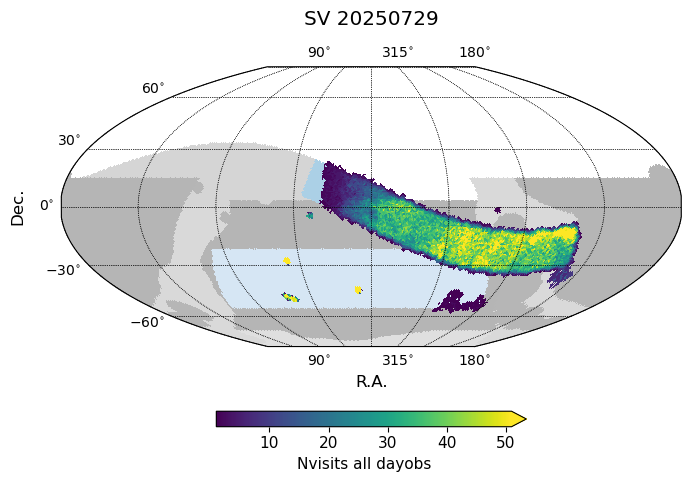
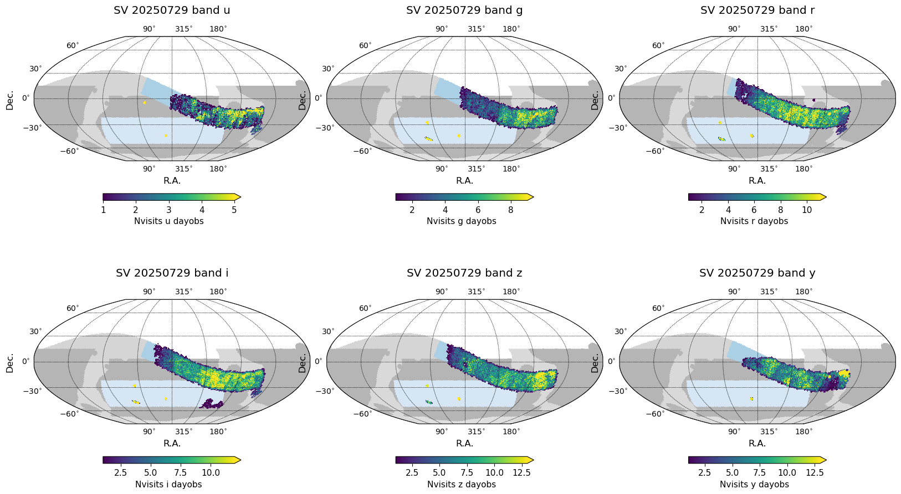
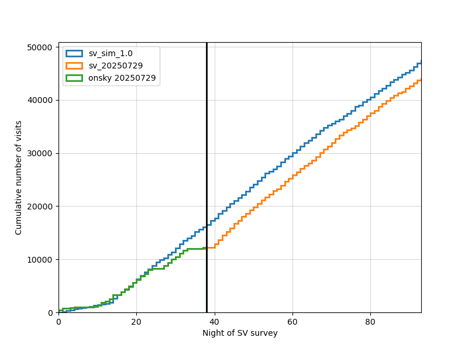
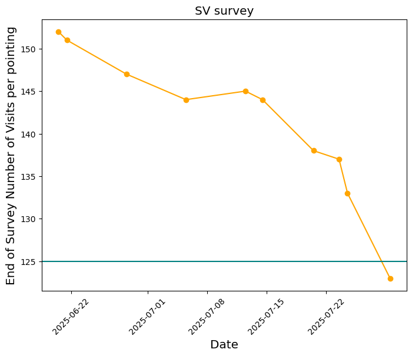
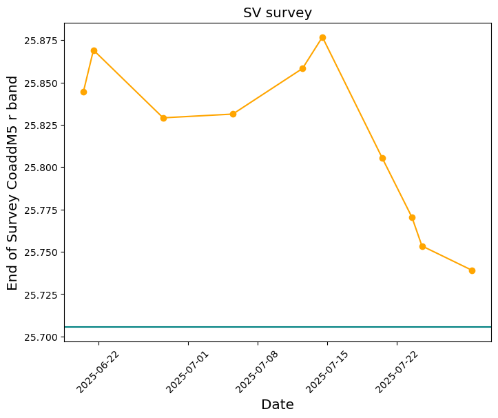

.. _SV_20250729:

 
############
SV 20250729
############

 
As of 20250729, the SV survey has acquired a total of 12184 visits, of variable quality. 
The median numbers of visits per pointing within the primary wide SV survey area are: 

=====================  ===  ===  ===  ===  ===  ===  =====
..                       u    g    r    i    z    y    all
=====================  ===  ===  ===  ===  ===  ===  =====
(20250729, 'Nvisits')    2    3    7    7    7    5     34
=====================  ===  ===  ===  ===  ===  ===  =====

A simulation database containing acquired visits up to 20250729 and extended to the end of the SV survey: `sv_20250729.db <https://s3df.slac.stanford.edu/data/rubin/sim-data/sv/sv_progress_databases/sv_20250729/sv_20250729.db>`_. 
Note that these databases contain preliminary visit metadata; not all visits will successfully pass through processing into data releases, and metadata may change with further processing or information. The system is still under commissioning. 

The SV survey has now acquired approximately 25% of its expected visits. 

 

The current and predicted number of visits over time is shown above.
However we can also look at how the prediction for the total number of
visits at the end of survey has changed with each incremental simulation.
Looking at the predictions for the end of survey in this way, we can see
that early predictions for the total number of visits were quite high;
more recent predictions have fallen in comparison. This primarily
reflects the effects of more nights where the observatory has been
closed due to weather; the dome has remained entirely closed for
five nights within the last week, with another partial three nights
in the preceding weeks. It also reflects time spent on other commissioning
activities than the SV survey; visits were acquired for the small field
science and for AOS tests, in a shift away from an early unexpectedly strong
emphasis on SV visits.

Likewise, we can look at the current prediction for coadded
depth over the primary SV survey area and how this has changed over time.

 
 
 
.. toctree:: 
    :maxdepth: 2 
    :titlesonly: 
    :glob: 

.. admonition:: Last Updated 
 
  Last Updated 2025/07/30 
..   * 
