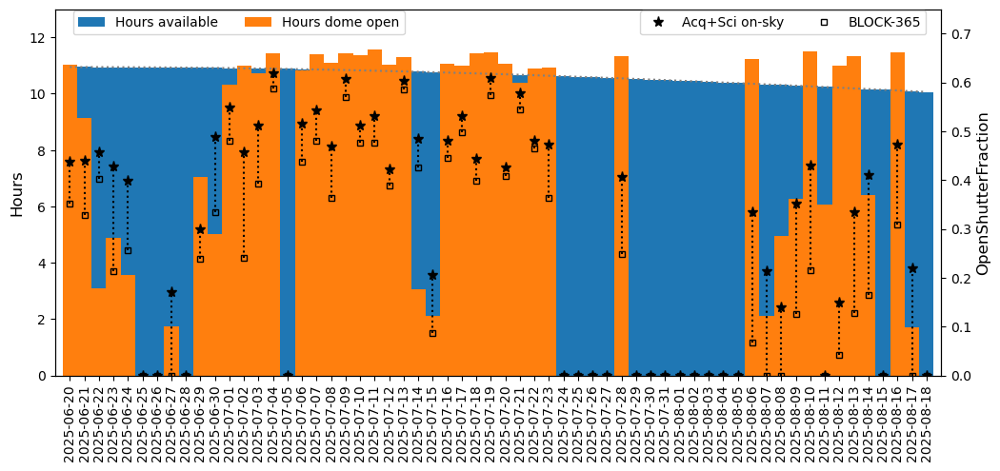

.. _SV_20250818:

 
############
SV 20250818
############

This is a big update, pairing with the `2025-08-15 commissioning update <https://community.lsst.org/t/2025-08-15-on-sky-commissioning-update/10817>`_.

Weather has not been kind to the commissioning effort in the last several weeks.
A combination of clouds and snow from a series of winter storms has impacted on-sky time.
Additional dome closures were required due cold weather and the current sensitivity of the LSSTCam cryogenic
refrigeration system to low ambient temperatures.
A small additional amount of time was lost due to telescope or camera control issues.
On-sky hours have been extremely limited as a result; this can be seen in the plot below,
in the comparison of orange (dome open hours) vs. blue (available night time hours) bars.
Nights post 2025-07-24 are primarily closed-dome (blue bars).

Further, due to issues with the variability of the delivered image quality (IQ) to date,
additional time will be spent on tests designed to improve the systems which impact the delivered image quality.
This can also be seen in the plot below, in the comparison of total exposure time divided by the total available night time,
considering all on-sky images including time spent in other tests (stars)
vs. only commissioning science visits (SV, ToO, and small field science) (open squares).
Nights post 2025-07-24 demonstrate larger gaps between the open-shutter fraction for all on-sky images
and science images, as more time is spent on non-commissioning science images.

  Hours on sky and with dome open during the SV survey to date.

As of 20250818, the SV survey has acquired a total of 13086 visits, excluding known bad visits,
and still including visits with a wide range of data quality, due to both cloud extinction and delivered IQ.
Only 3236 of these visits have been obtained in the last 30 days of the 94 day SV survey period.
The SV survey period is approximately 63% complete.

New SV configuration
====================

All of the factors above have led to a reconsideration of the area to be included for the
remainder of the SV period.
Instead of attempting to obtain a few more visits over the full ~3k square degrees, we are pivoting to cover
a much smaller area (~750 sq degrees) while also working to improve the delivered image quality,
thus driving better templates for this area.

We are also redirecting these visits in 'g', 'r', 'i', and 'z' bands, dropping 'u' and 'y'.
This is primarily due to the (temporary) failure of one of the filter slots in the carousel,
which will be addressed during the October shutdown.
Carrying out additional filter swaps to move additional filters in and out of the carousel was not
compatible with ongoing daytime commissioning work in the dome.
Further, given the push to obtain template images using the remaining time in August,
concentrating on fewer bandpasses seems wise.

A simulation of the updated SV survey, containing acquired visits up to 2025-08-18 and
extending to the end of the SV survey is available at `sv_20250818.db <https://s3df.slac.stanford.edu/data/rubin/sim-data/sv/sv_progress_databases/sv_20250818/sv_20250818.db>`_.
The known bad visits (238) have been removed from this database.
The simulated extension of the SV survey follows the new, smaller footprint,
and only obtains images in 'g', 'r', 'i', and 'z'. It runs through 2025-09-21.

To help understand the current predictions for the END of SV, the plots below show the total visits
in SV, including current and predicted visits. The reduced area for the remainder of SV can be seen
within the larger primary ecliptic area; it now stretches from ecliptic longitude 285-360 degrees,
within ecliptic latitudes of +/- 5 degrees.

  Acquired (2025-06-20 to 2025-08-18) plus simulated (2025-08-18 to 2025-09-22) visits in SV.

An important update for the new simulation is the included downtime.
Now, downtime due to our standard weather model is included when running the simulation
(this was not included in the original sv_sim_1.0; post on weather coming soon).
Our current weather model does not include downtime due to cold temperatures, which
likely leads to an underestimate of weather downtime.
Beyond downtime due to weather, the plot below illustrates lost to expected engineering activities
(black lines = downtime).
Downtime during visits that have already been acquired is based on the actual time
that was used for the SV survey.
Downtime in the future (beyond the vertical red dashed line), is estimated.
Estimates include:  time spent on other commissioning activities to improve image quality,
simulated by blocking 4-5 hours per night as 'downtime' until 2025-08-30;
the dome closes 2 hours prior to 0-degree sunrise, consistent with current requirements around dome closure;
the first thirty minutes or so of the night is marked as 'downtime',
consistent with current performance around start-of-the-night activities.

  Downtime from the past (based on actual SV time onsky) and into the future (in the simulation).

The cumulative visits so far, extended through the end of SV with a simulation
folding in the above downtime are shown in the next figure. The original
"sim_sv_1.0" is also shown for contrast; this original simulation did not include
downtime due to weather, although it did include significant downtime due to engineering.
The weather impacts have been significant.

  Cumulative number of visits in the SV survey, to date and to end of SV.

 
Visits acquired in the SV survey to date
========================================

Visits per pointing within primary SV area:

=====================  ====  ====  ====  ====  ====  ===  =====
..                        u     g     r     i     z    y    all
=====================  ====  ====  ====  ====  ====  ===  =====
(20250818, 'Nvisits')   2     4    11    12     8      9   47
(20250818, 'CoaddM5')  24.4  25.2  25.2  24.7  23.9   23   25.7
=====================  ====  ====  ====  ====  ====  ===  =====

.. figure:: ../../figures/sv_20250818/sv_@_20250818_nvisits_band.png
  :width: 650
  :alt: SV survey acquired visits, all bands.

  Acquired to date (2025-06-20 to 2025-08-18) visits in SV.

 
.. toctree:: 
    :maxdepth: 2 
    :titlesonly: 
    :glob: 

.. admonition:: Last Updated 
 
  Last Updated 2025/08/18 
..   * 
