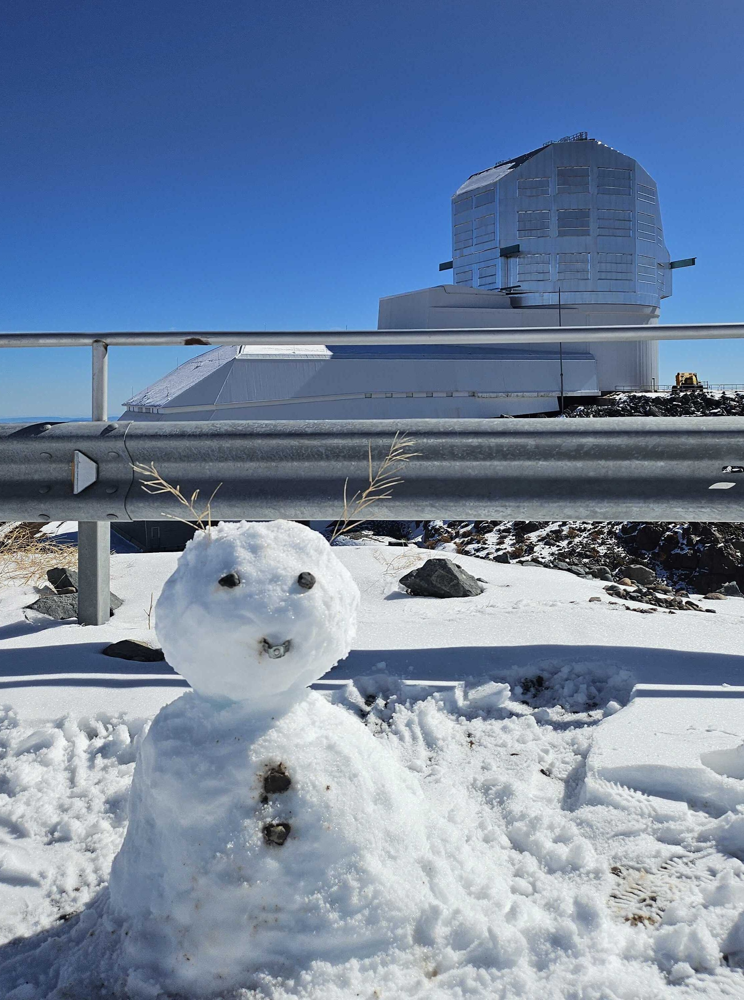
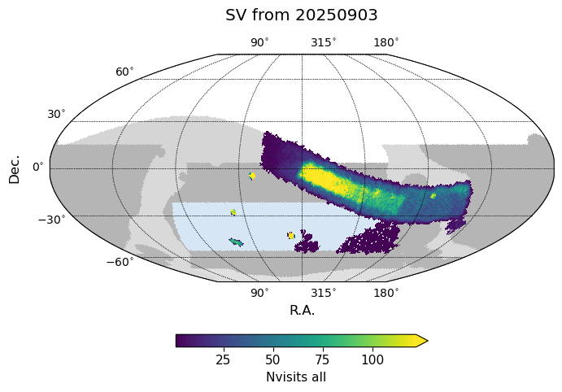
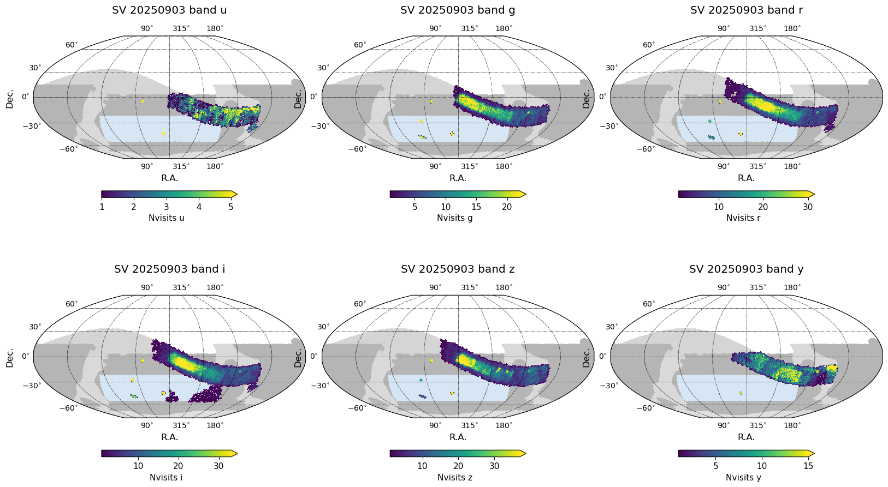
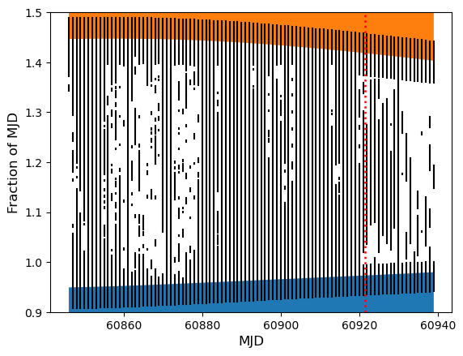
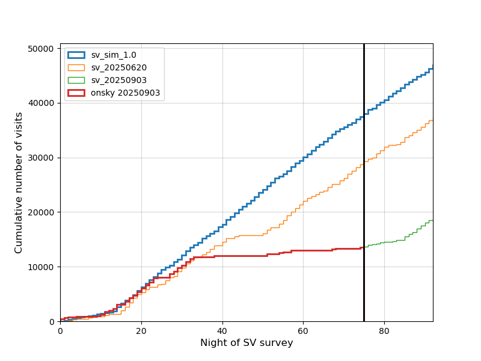
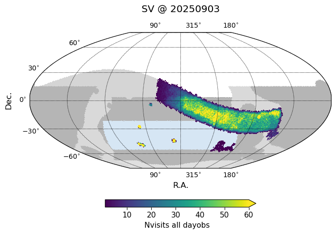
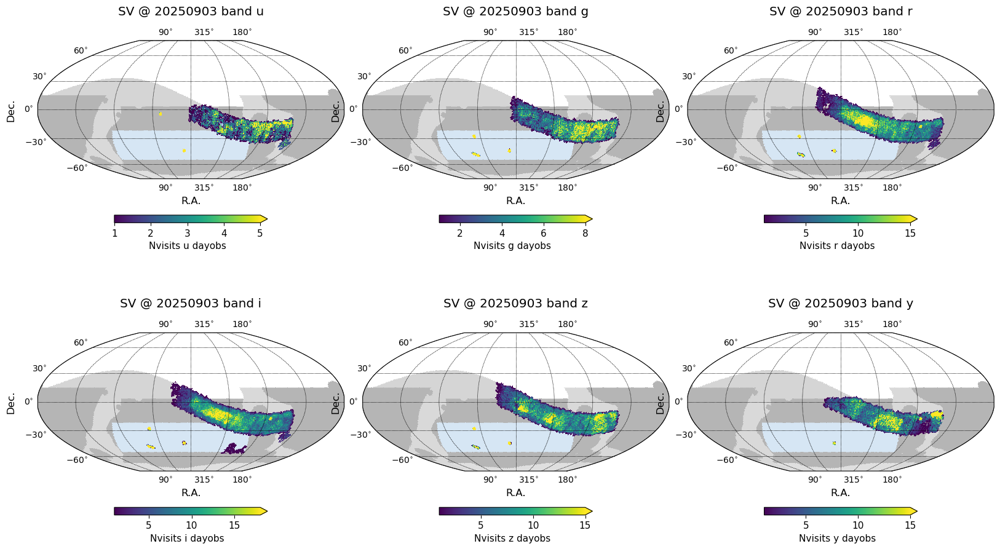

.. _SV_20250903:

 
####################
SV 20250903
####################

Snowman at Rubin, 20250824, photo by Minhee Hyun.
 
Weather and time spent on engineering tests to improve image quality continue to impact the SV survey. From the time of the last update on 20250818 to 20250903, there have been only 4 nights with any SV observations and only 540 visits have been acquired. A large fraction of those have been under quite cloudy conditions.

Additional descopes are in play now for the SV survey, beyond the reduction of the primary wide area from 3000 sq degrees down to 750 sq degrees (as discussed in :ref:`2025-08-18 <SV_20250818>`). The time available to observe deep drilling fields (DDFs) is
limited, as these are still rising later in the night. While the ELAISS1 field rises early enough that it has reasonably good coverage in all bandpasses to date, the other DDFs are competing for the same (now more limited) periods of time. Observing fewer DDFs to deeper limiting magnitudes is preferential for testing and developing DM Science Pipelines, but this requires prioritizing one or two DDFs above the others.

ELAISS1, having the most coverage and being the easiest field to observe given its location on the sky and the current time of year, will continue to be observed. Out of the other DDFs, we have tentatively decided to prioritize XMM-LSS above ECDFS or EDFS_a (and EDFS_b) as it holds more multi-wavelength coverage including spectroscopic coverage. The bigger point is that we will need to choose a subset of two of our current DDFs for further observations during SV.

Depending on how the next week or so of commissioning goes, we may find it necessary to consider prioritizing between obtaining images in fields with existing templates (and thus testing alert generation and distribution) and concentrating visits into limited area in order to test deep coadd generation against observing a wider area to demonstrate improvements in image quality.

Predictions for end of SV
=========================

The current predictions from now to the end of the SV survey still contain significant uncertainty, primarily due to uncertainty about time which must be spent in other engineering activities, but also keeping in mind that over short time periods, the impact of weather is much more significant than it is over the period of years. 

Acquired (20250620 to 20250903) plus simulated (20250903 to 20250922) visits in SV. 

Beyond downtime due to weather, the plot below illustrates lost to expected engineering activities (black lines = downtime). Downtime during visits that have already been acquired is based on the actual time that was used for the SV survey. Downtime in the future (beyond the vertical red dashed line), is estimated. Estimates include:  time spent on other commissioning activities to improve image quality, closing the dome two hours prior to 0-degree sunrise, and blocking the first thirty minutes or so of the night for start of night activities.

Downtime from the past (based on actual SV time onsky) and into the future (in the simulation). 

The cumulative visits so far, extended through the end of SV with a simulation folding in the above downtime are shown in the next figure. The original sim_sv_1.0' (with no weather downtime) and 'sv_20250620' (like sim_sv_1.0 but with weather downtime) are also shown for comparison.

Cumulative number of visits in the SV survey, to date and to end of SV. 

A simulation database containing acquired visits up to 20250903 and extended to the end of the SV survey: `sv_20250903.db <https://s3df.slac.stanford.edu/data/rubin/sim-data/sv/sv_progress_databases/sv_20250903/sv_20250903.db>`_. 
Note that these databases contain preliminary visit metadata; not all visits will successfully pass through processing into data releases, and metadata may change with further processing or information. The system is still under commissioning.
A small caveat about this particular database: the quicklook processing at the summit which produces PSF and zeropoint measurements for each visit was not populated into the replica database accessible at the USDF; this information is likely to be backfilled in the next few days but is missing at the time that sv_20250903.db was generated. 

Visits acquired in the SV survey to date
========================================

As of 20250903, the SV survey has acquired a total of 13533 visits, excluding known bad visits, and still including visits with a wide range of data quality, due to both cloud extinction and delivered IQ. 

The median numbers of visits, coadded depth, and effective exposure time per pointing within the (now reduced, 750 sq deg) primary wide SV survey area to date are:

=====================  ====  ====  ====  ====  ====  ===  =====
..                        u     g     r     i     z    y    all
=====================  ====  ====  ====  ====  ====  ===  =====
(20250903, 'Nvisits')   2     4    11    13     9      9   51
(20250903, 'CoaddM5')  24.4  25.2  25.2  24.8  23.9   23   25.8
=====================  ====  ====  ====  ====  ====  ===  =====

Acquired to date (20250620 to 20250903) visits in SV.

 
 
 
.. toctree:: 
    :maxdepth: 2 
    :titlesonly: 
    :glob: 

.. admonition:: Last Updated 
 
  Last Updated 2025/09/03 
..   * 
