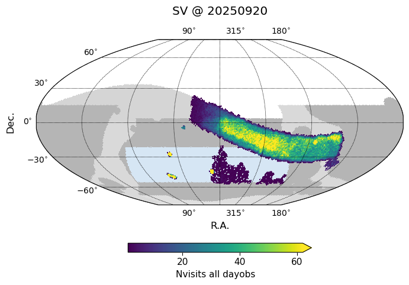
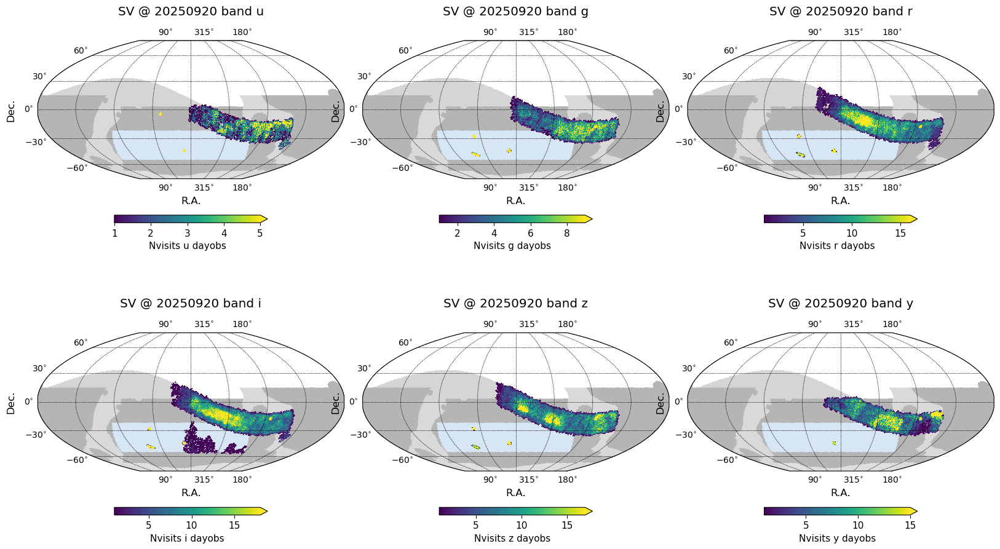

.. _SV_20250920:

 
####################
SV 20250920
####################

With only two more nights of SV observing remaining, this is an almost-final update.

Unfortunately, tests to improve the image quality continued to require the majority of commissioning time over the last few weeks and only 708 additional SV visits have been acquired since the last update on 2025-09-03.

An incremental DRP did produce templates over a limited area of the SV footprint, including ELAISS1 and ECDFS deep drilling fields and a limited area between RA of 300 to 325, Declination -10 to -26 (about 300 sq degrees). To maximize return from the limited SV time on sky available, we have also restricted the SV survey to these areas, permitting tests of alert production. After deploying these templates, just over 200 visits have passed through prompt processing and generated alerts.

This area restriction will remain in place for the last few hours of SV operation remaining.
A database containing a highly uncertain prediction for the last two nights of SV, plus the visits to date, is available at `sv_20250920.db <https://s3df.slac.stanford.edu/data/rubin/sim-data/sv/sv_progress_databases/sv_20250920/sv_20250920.db>`_.

Visits acquired in the SV survey to date
========================================

As of 20250920, the SV survey has acquired a total of 14235 visits, excluding known bad visits, and including visits with a wide range of data quality, due to both cloud extinction and delivered IQ.

The median numbers of visits, coadded depth, and effective exposure time per pointing within the 750 sq deg v2 wide SV survey area to date are:

=====================  ====  ====  ====  ====  ===  ===  =====
..                        u     g     r     i    z    y    all
=====================  ====  ====  ====  ====  ===  ===  =====
(20250920, 'Nvisits')   2     4    12    15     10    9   55
(20250920, 'CoaddM5')  24.4  25.2  25.2  24.8   24   23   25.8
=====================  ====  ====  ====  ====  ===  ===  =====

Acquired to date (20250620 to 20250920) visits in SV.

 
 
 
.. toctree:: 
    :maxdepth: 2 
    :titlesonly: 
    :glob: 

.. admonition:: Last Updated 
 
  Last Updated 2025/09/03 
..   * 
