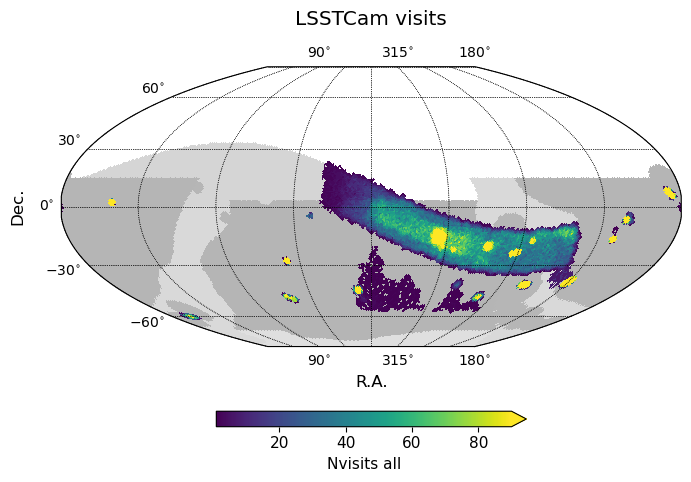
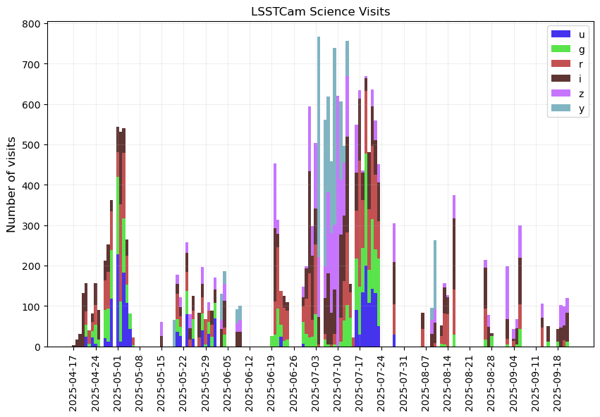
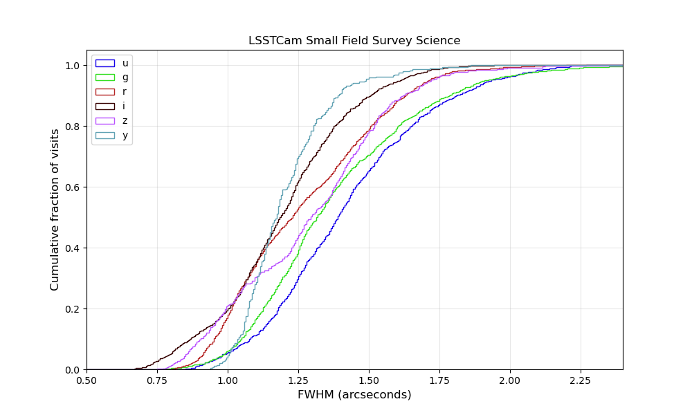
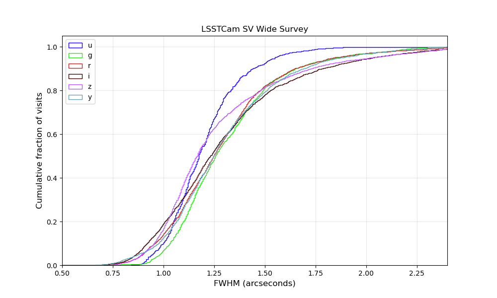
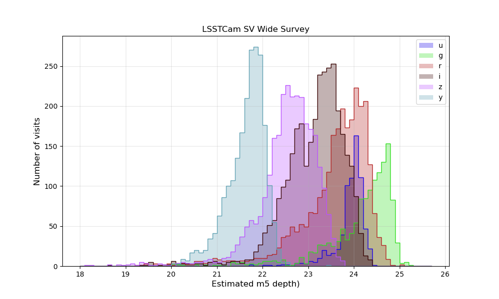
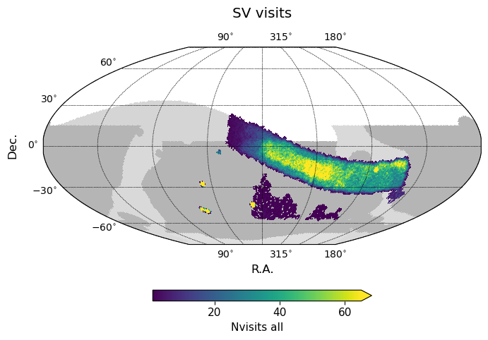
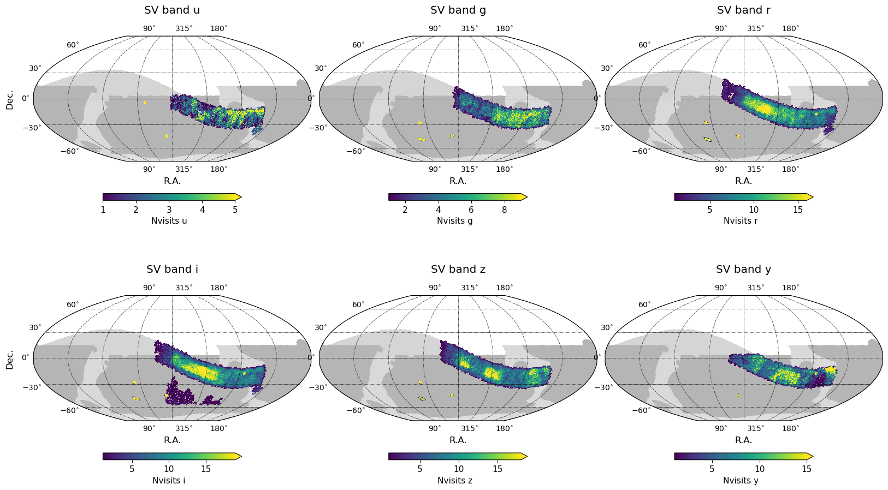
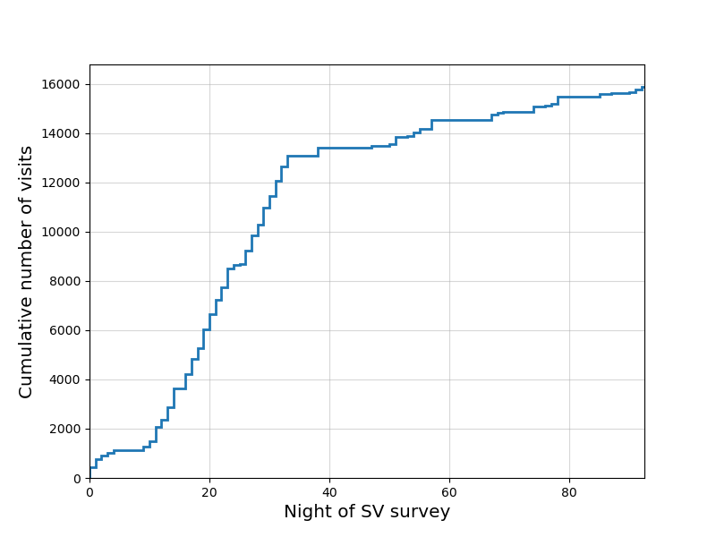
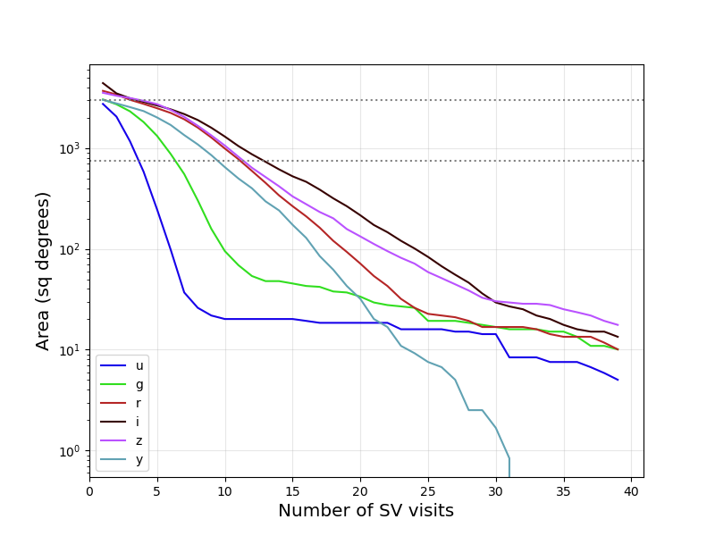
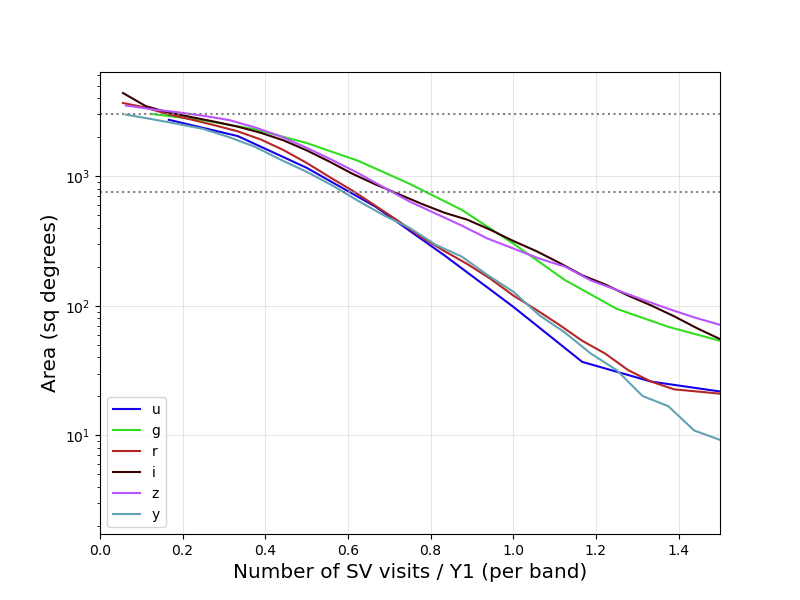

.. _SV_20250930:

##########################################
Summary 20250930
##########################################

  All science visits acquired during LSSTCam commissioning.

The initial LSSTCam commissioning period has come to a close after the last night
of SV data acquisition on 20250921.

Science images with LSSTCam began 20250417, at first acquiring small field survey visits
dithered over small areas around a central boresight.
These visits were generally acquired in sequences of at least 10 visits per bandpass,
cycling through available bandpasses, in a manner similar to acquiring small field survey science visits
during ComCam commissioning (which resulted in images available as part of DP1).

The Science Validation (SV) survey began on 20250620, acquiring visits in a manner consistent with the
planned operations survey for the LSST, although with a much more limited area to facilitate gaining
depth within the SV timeline.
The SV survey consisted of a wide area following the ecliptic plane from dense regions of the Galactic Bulge
through low-dust regions within the planned LSST Wide Fast Deep (WFD) footprint and included
four of the planned LSST Deep Drilling Fields (DDFs). A secondary area within the low-dust WFD was included
to provide targets when the primary or DDF fields were not available, with the intention of providing images
to help boost early template generation in these higher-declination areas.

During this commissioning period, a total of 21647 science visits were acquired.
This count is after excluding known bad visits (as of 20250930), but includes visits with a
wide range of data quality, due to both cloud extinction and/or delivered IQ or engineering
issues. Of these, 7194 were obtained in small field survey science mode, 908 specifically for DDFs,
and 13240 for the primary wide SV area.
The bulk of these visits were acquired between 20250417 and 20250724,
due to a combination of weather and necessary engineering tests to improve delivered image quality.

  Timeline of science visit acquisition.

Visit Database
==============

A database compiling the visits from the small field survey as well as the SV observations is available at
`lsstcam_20250930 <https://s3df.slac.stanford.edu/data/rubin/sim-data/sv/sv_progress_databases/lsstcam_20250930/lsstcam_20250930.db>`_.
Information contained in the database is based on entries in the `Consolidated Database <https://sdm-schemas.lsst.io/cdb_lsstcam.html>`_, including per-visit summary values from summit ``quicklook`` processing.
Additional columns have been added as part of post-processing from the `rubin_nights <https://github.com/lsst-sims/rubin_nights>`_ package.
The database follows the current `opsim schema <https://rubin-scheduler.lsst.io/fbs-output-schema.html>`_, but adds the columns from the ConsDb and rubin_nights, as described in the links above.
Future updates are anticipated, which may include additional data values added where some entries are NaN (as some of the ConsDb entries are backfilled) or additional information pulling from per-detector values in the ConsDb.

The small field survey science visits can be identified by ``field_survey_science`` in the ``observation_reason`` in the database
(and vice versa, SV visits can be identified by excluding ``field_survey_science``).
Visits acquired as part of DDF sequences can be identified by ``ddf`` as part of the ``observation_reason``.
In general, the ``observation_reason`` identifies the source of the visit within the FBS (which ``Survey`` object requested the visit), while the ``target_name`` identifies the region on the sky for the visit.
For the small field survey visits, the ``target_name`` was simply configured as the particular field target.
For SV visits, the ``target_name`` is configured as expected for the LSST, where DDF (or other particular targets) can
overlap other general wide areas of the survey such as the ``low_dust`` footprint area, so ``target_name`` will identify
both the DDF name as well as the underlying footprint areas.

Small Field Survey Visits
=========================

The small field survey visits, including the images which contributed toward Rubin First Look, covered the following targets:

===================  ===  ===  ===  ===  ===  ===  =====
..                     u    g    r    i    z    y    all
===================  ===  ===  ===  ===  ===  ===  =====
Carina                22   16   23   63  ---  ---    124
Rubin\_SV\_280\_-48   30   30   29   30   29  ---    148
ELAIS\_S1             11   30   30   30   35   30    166
Rubin\_SV\_320\_-15  ---   29   17  105   52   70    273
New\_Horizons         36   49   70  108   74   23    360
Rubin\_SV\_216\_-17  ---   64   95  227  ---  ---    386
Rubin\_SV\_212\_-7   ---  139  236  123  ---  ---    498
Prawn                196  164  149   93   30  ---    632
COSMOS               100   82  166  139  111   66    664
Trifid-Lagoon        235  196  122  115  ---  ---    668
M49                  261  280  378  254  ---  ---   1173
Rubin\_SV\_225\_-40  312  568  441  387  240  104   2052
===================  ===  ===  ===  ===  ===  ===  =====

These images were generally acquired in sequences which cycled through each available bandpass, although with a variety of
sequence lengths and dither patterns. However, because these images were acquired in these sequences where the atmospheric
seeing contributions were relatively consistent during the sequence (on average), the image quality
distribution is generally better redder bands than bluer bands. This effect also shows up in DDF visits in the SV survey,
but for wide area visits it is muted as visits in different bandpasses sample different atmospheric conditions and the
Feature Based Scheduler (FBS) chooses which bandpass to use in part based on the current seeing conditions.

The table below shows the median FWHM for the visits for each small field survey target. These are the
median values of the median value for each visit, so do not capture any potential issues with FWHM variations
across the field of view. It also includes an estimate of the mean cloud extinction in the images. These
are estimates based on the measured zeropoints for the images, compared to the expected zeropoint for an
image in that bandpass at that airmass. A potential issue here is that visits with very heavy cloud
extinction (or other problem with the quicklook image processing occuring immediately after image acquisition)
may not succeed in measuring a zeropoint for the image at all, and thus no estimate for the
cloud extinction will be possible either. Timespan indicates the number of nights between the first and last
visit for the field.

===================  =========  ======================  ==================  =================
..                     nvisits    median fwhm (arcsec)    mean cloud (mag)    timespan (days)
===================  =========  ======================  ==================  =================
Carina                     124                  ---                 ---                     4
Rubin\_SV\_280\_-48        148                    1.52                0.08                  1
ELAIS\_S1                  166                    1.38                0.44                 17
Rubin\_SV\_320\_-15        273                    1.22                0.03                  6
New\_Horizons              360                    1.05                0.2                  62
Rubin\_SV\_216\_-17        386                    1.29                0.01                  8
Rubin\_SV\_212\_-7         498                    1.21                0.05                  7
Prawn                      632                    1.37                0.07                 79
COSMOS                     664                    1.22                0.28                 15
Trifid-Lagoon              668                    1.14                0.06                 10
M49                       1173                    1.29                0.08                 13
Rubin\_SV\_225\_-40       2052                    1.36                0.25                 97
===================  =========  ======================  ==================  =================

SV Survey Visits
================

The SV survey includes visits from 20250620 to 20250921, with a total of 14453 visits acquired (after excluding known bad visits).
Of these, 13240 were acquired for the wide area, while 908 were acquired for DDF visits.
This is approximately 6% visits for DDF, which is consistent with expectations for the operations LSST.
There were 194 visits acquired for Target of Opportunity (ToO) testing purposes, or approximately 1.3% of the total SV visits.
The remaining visits were located in the "backup" area configured to provide future-template building targets when the primary area or DDFs were unavailable due to requirements to avoid the moon or azimuth constraints near dawn.

SV Wide
-------

The initial SV wide area was approximately 3000 square degrees; this was reduced to 750 square degrees approximately halfway through the SV survey period (see :ref:`2025-08-18 <SV_20250818>` for more information).
This was further reduced to approximately 300 square degrees during the last week or so of the SV period, to better enable difference image tests (see :ref:`2025-09-20 <SV_20250920>` for more information).
The median numbers of visits and coadded depths reported below are based medians within each of these subsets of wide SV area.

==================  ====  ====  ====  ====  ====  ====  =====
..                     u     g     r     i     z     y    all
==================  ====  ====  ====  ====  ====  ====  =====
('3k', 'Nvisits')    2     4     7     8     7     5     38
('3k', 'CoaddM5')   24.2  25    24.9  24.5  23.8  22.6   ---
('750', 'Nvisits')   2     4    12    16    11     9     56
('750', 'CoaddM5')  24.4  25.2  25.2  24.8  24    23     ---
('300', 'Nvisits')   2     5    11    18    15    10     64
('300', 'CoaddM5')  24.5  25.2  25    24.9  24.1  23     ---
==================  ====  ====  ====  ====  ====  ====  =====

The image quality was an issue during the SV observations.
This is revealed in part as a PSF larger than expected, given estimates of the
atmospheric contribution, but also in variations in the PSF across the field of view.
In general, the median-per-visit PSF reported for the SV images is not excessively larger than the typical values expected
at this time of year, but the shape and variability of the PSF is likely to be below full survey expectations.

The individual image depth throughout the SV wide area is comparable to the depth expected from baseline survey simulations.
The shallower depths in r and i is likely due to slightly worse seeing than in the simulations, but could also be due to cloud cover.

======================  ====  ====  ====  ====  ====  ====
..                         u     g     r     i     z     y
======================  ====  ====  ====  ====  ====  ====
Estimated 5sigma depth  24.0  24.4  23.8  23.2  22.6  21.7
Baseline 5sigma v5      23.4  24.5  24.1  23.5  23.0  22.0
======================  ====  ====  ====  ====  ====  ====

SV DDFs
-------

Within the SV survey, the DDFs had variable completeness.
The timing of the SV survey was relatively early in the observing season for any of the DDFs, and COSMOS was completely unavailable.
The other DDFs became observable near the tail end of the night starting in July, with ELAISS1 rising first.
As such, ELAISS1 received the most visits, but the other DDFs were difficult to observe given the limited SV time on-sky.
Only ELAISS1 received visits in all of ugrizy.
Most of the other DDFs were observed in griz, which were the only bandpasses available after 20250810.
The XMM-LSS field never received visits in any band other than u; there were some complications due to the compressed observing
cadence (and resulting heightened competition between DDFs), the azimuth constraints at the end of the night,
the patchiness of SV observing time, and this field also became unavailable at times due to moon avoidance.

The dither pattern used for the DDFs evolved over time.
Initially, the dithers were quite small and were not dithered within a night.
Scattered light proved to be a problem for these fields, and the lack of dithers within a night became
a problem in terms of building template images.
In later observations, dithers within a night (both translational and rotational) were adopted; dithers from night to night continued.
The minimum dither useful for the DDFs at this time seems to be on the order of 0.2 degrees (max radius; the range is about 0.4 deg). This dither will need to be continued within the night as well as between nights.

=============  ===  ===  ===  ===  ===  ===  =====
..               u    g    r    i    z    y    all
=============  ===  ===  ===  ===  ===  ===  =====
ddf\_xmm\_lss   30  ---  ---  ---  ---  ---     30
ddf\_edfs\_a   ---   20   21   28   18  ---     87
ddf\_edfs\_b   ---   24   21   29   18  ---     92
ddf\_ecdfs     ---   36   39   41   44  ---    160
ddf\_elaiss1    39  101  103  168  112   16    539
=============  ===  ===  ===  ===  ===  ===  =====

=============  =========  ======================  ==================  =================
..               nvisits    median fwhm (arcsec)    mean cloud (mag)    timespan (days)
=============  =========  ======================  ==================  =================
ddf\_xmm\_lss         30                    1.47                0.07                 10
ddf\_edfs\_a          87                    1.32                0.16                 55
ddf\_edfs\_b          92                    1.37                0.13                 55
ddf\_ecdfs           160                    1.51                0.17                 57
ddf\_elaiss1         539                    1.4                 0.1                  84
=============  =========  ======================  ==================  =================

SV Combined
-----------

  Number of SV survey visits, all bands.

  Number of SV survey visits, per band.

  Cumulative visit acquisition over time for the SV survey.

The amount of area observed with the equivalent of 1 year WFD number of visits in each of giz band was around 300 sq degrees.
While not much area was observed with u band, over 1000 sq degrees did receive at least the equivalent of 6 months of LSST visits.
The rate of visit acquisition will be investigated further in a separate post.

